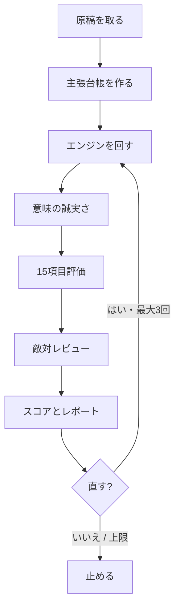
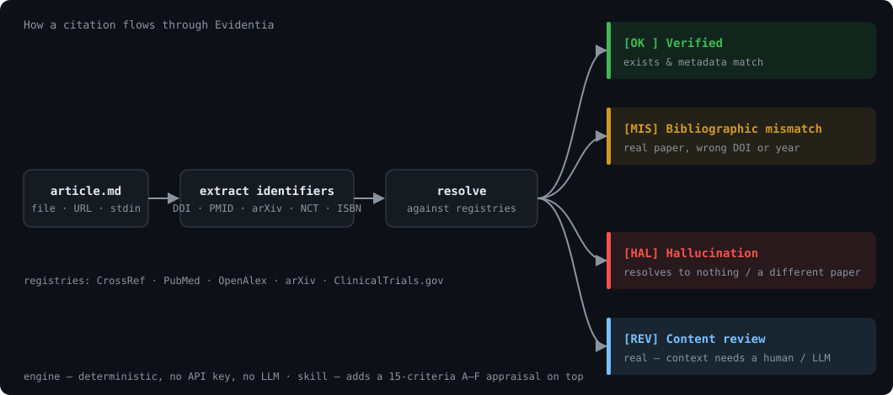

<div align="center">

# Evidentia

### AIが捏造した医学引用を、公開前に捕まえる。

Evidentia は医学文章中のすべての引用を **CrossRef・PubMed・OpenAlex・arXiv・ClinicalTrials.gov** に照合し、4段階で分類します。エージェントスキルはまず **主張台帳** を作り、エンジン / 意味 / 敵対 / 修正の4つのループを回してから A〜F を出します。作者は小児科専門医。

**サイト:** [https://kgraph57.github.io/evidentia/](https://kgraph57.github.io/evidentia/)

[](https://www.npmjs.com/package/evidentia)
[](LICENSE)
[](https://code.claude.com/docs/en/skills)

[](README.md) [](README.ja.md)

🌐 For English, see **[README.md](README.md)**

</div>

---

> **なぜ今か:** 250万本の生物医学論文を監査した *Lancet*（Topaz et al., *Lancet* 2026;407(10541):1779–1781; [doi:10.1016/S0140-6736(26)00603-3](https://www.thelancet.com/journals/lancet/article/PIIS0140-6736(26)00603-3/fulltext)）の調査で、捏造文献は **2023年は2,828本に1本**、**2025年は458本に1本**（約6倍）、**2026年最初の7週間は277本に1本** でした。2023年比で約10倍の増加で、生成AIライティングツールの普及と時期が一致しています（監査対象はPubMed Centralオープンアクセス収載分）。報道: [STAT](https://www.statnews.com/2026/05/07/lancet-study-finds-steep-rise-fraudulent-citations-academic-papers/)（2026年5月7日） ・ [Nature](https://www.nature.com/articles/d41586-026-00748-w) ・ [Columbia看護学部](https://www.nursing.columbia.edu/news/nearly-3-000-peer-reviewed-medical-papers-have-fake-citations-columbia-nursing-ai-assisted-audit-finds) ・ [Retraction Watch](https://retractionwatch.com/2026/05/07/one-in-277-pubmed-indexed-papers-in-2026-shows-fabricated-references-says-analysis/)。のちに Department of Error が出ています（[doi:10.1016/s0140-6736(26)01339-5](https://doi.org/10.1016/s0140-6736(26)01339-5)、2026年7月）。ここに書いた発生率は原報とSTAT報道に従っています。
>
> 捏造されたDOIは、本物のDOIと見分けがつきません。Evidentia は一つずつ実際に解決し、どれが本物でどれが偽物かを教えます。

> ⚕️ **適用範囲:** Evidentia は執筆者・編集者・研究者のための公開前支援ツールであり、**臨床判断支援ではありません。** 診断・治療・医療専門家の判断を代替しません。

## 30秒で始める

サイト: [https://kgraph57.github.io/evidentia/](https://kgraph57.github.io/evidentia/)

**コマンドラインツールとして**（インストール不要・APIキー不要）:

```bash
npx evidentia check your-article.md
```

**エージェントスキルとして**（主張台帳 + 4つの検証ループ。`SKILL.md` が `skills/medical-fact-check/SKILL.md` にあるので動きます）:

```bash
npx skills add kgraph57/evidentia
```

**Claude Code プラグインとして**:

```bash
/plugin marketplace add kgraph57/evidentia
/plugin install evidentia@evidentia
```

あとは「この記事をファクトチェックして」と言うだけです。

**Codex Desktop プラグインとして**:

```text
Marketplace source: https://github.com/kgraph57/evidentia.git
Plugin: evidentia
```

## 何を捕まえるのか

ビタミンDと小児感染症についての、実際のAI生成回答に対して Evidentia を実行した例です。引用は4件、書式は完璧、どれも一見もっともらしく見えます:

```text
$ npx evidentia check examples/inputs/ai-generated-answer.md

Evidentia: 4 citations — 1 verified, 1 mismatch, 2 hallucinated (75.0% fabrication rate)
  [OK ] doi:10.1136/bmj.i6583       — 論文は実在し、引用メタデータも一致
  [HAL] doi:10.1056/nejmoa2105512   — CrossRef・OpenAlex のどちらでも解決せず、一致する論文なし
  [HAL] pmid:18768876               — 引用とは別の論文を指している
  [MIS] doi:10.1002/14651858.cd012734 — 論文は実在するが、メタデータ（年）が不一致
```

実在は1件。1件はDOIをでっち上げ。1件のPMIDは無関係な論文を指し、1件は年が誤り。**人間のレビュアーなら4件すべてを手で確認する必要があります。** Evidentia は数秒で終えました。[エンジンの全文レポート](examples/reports/ai-generated-answer.report.md)。同じファイルをスキルのパイプライン（主張台帳 → 意味チェック → 敵対レビューで **KILL**）で歩いたものが [examples/case-studies/vitamin-d-adversarial.md](examples/case-studies/vitamin-d-adversarial.md) です。

## 4段階分類

多くの「引用チェッカー」は *「検証できませんでした」* で止まります。Evidentia はそこから踏み込み、識別子を実際に解決して **なぜ** その引用が疑わしいのかを示します:

| Tier | 判定 | 意味 |
|:----:|------|------|
| ✅ **1** | **検証済み** | 論文が実在し、引用のタイトル/著者/年/誌名がレジストリ記録と一致 |
| ⚠️ **3** | **書誌の不一致** | 実在する論文だが、DOI/PMID が誤っている、またはメタデータが食い違う |
| ❌ **4** | **ハルシネーション** | 識別子が何も解決しない、または *まったく別の* 論文を指す。AI生成テキストの典型 |
| 🔍 **2** | **内容レビューが必要** | 論文は実在するが、*正しい文脈で使われているか* は人間かLLMの判断が必要（下記スキルが担当） |

## 2層構成: 決定論エンジン + LLM評価

Evidentia は「機械が完璧にできる部分」と「判断を要する部分」を意図的に分けています。

**1. エンジン（CLI + MCPサーバー）** — 純粋に決定論的な引用検証。APIキー不要、LLM不要、それ自身がハルシネーションを起こすこともありません。「この引用論文は本当に実在し、識別子はそれを指しているか?」という1点を確実に答えます。ターミナル、CI、または任意のエージェントの MCP ツールとして使えます。

**2. スキル（Claude Code）** — エンジンを **主張台帳** と4つの名前付きループで包みます。エンジン、意味の誠実さ、敵対レビュー、修正（上限3回）。15項目のルーブリックはそのパイプラインの *中の一工程* であって、商品そのものではありません。判定は **KILL / MAJOR / MINOR / PASS**。KILL または MAJOR は A では出せません。エンジンだけではできない「正しく使われているか」の層です。

どちらも単独で使えます。組み合わせれば、引用の *存在*（決定論的）と引用の *誠実さ*（評価）の両方をカバーします。

## スキルはどう検証するか

エンジンは「実在するか」に答える。スキルは「誠実に使っているか」に答える。最初に15個の箱を埋める作業ではない。

**まず主張台帳。** 照合の前に、検証できる主張とその引用を全部抜き出す。見出しも主張のうち。書式は [`templates/claim-ledger.md`](skills/medical-fact-check/templates/claim-ledger.md)。

**名前の付いたループは4つ**（それぞれ打ち切り条件あり。詳細は [`skills/medical-fact-check/references/verification-workflow.md`](skills/medical-fact-check/references/verification-workflow.md)）:

1. **エンジン** — `evidentia check`。届かなければ1回だけ再試行。それでもダメなら `unresolved`。推測のハルシネーションは付けない。存在についてのエンジン出力が正本。T4 を「たぶん実在」に書き換えない。
2. **意味** — **Tier 1** の引用だけ、抄録を1回余分に取る。主張は主要アウトカム・対象集団・効果の向きと合うか。T3 や T4 をこのループで格上げしない。
3. **敵対** — 5つのレンズと10行のチェックリスト。判定は **KILL / MAJOR / MINOR / PASS**。最大3パス。直したら採点からではなくエンジンから入り直す。
4. **修正** — 著者が直したら、エンジン → 意味 → 敵対を再実行。上限3回。その後は止まって、残件を書く。

**KILL または MAJOR は A では出せない。** **KILL**（実在として出した T4、または従うと害が出る助言）は総合 ≤ D。捏造なら **F**。それが故障ではなく、仕組みが動いているということ。

実例: [ビタミンD — 主張台帳 → エンジン → 意味 → KILL](examples/case-studies/vitamin-d-adversarial.md)。収録してある引用4件のデモを、スキルのパイプラインで歩いたもの。



<details>
<summary><b>15の評価項目</b>（パイプラインの中の一工程であって、商品ではない）</summary>

1. エビデンスレベルと研究デザイン
2. 引用・出典の正確さ *(上記エンジンが担当)*
3. 統計解釈
4. 因果と相関
5. バイアスと利益相反
6. 誇張・過大主張
7. 対象集団への適合
8. 時間的妥当性
9. 専門用語と読みやすさのバランス
10. 倫理的配慮
11. 論理的整合性
12. 図表
13. 代替説明
14. 臨床的妥当性
15. 情報の完全性

各項目を **Excellent / Good / Fair / Poor** で評価し、総合 **A〜F** と **公衆衛生リスク**（LOW / MEDIUM / HIGH）にまとめたうえで、敵対判定でゲートする。詳細は [`skills/medical-fact-check/SKILL.md`](skills/medical-fact-check/SKILL.md)。
</details>

## MCPツールとして使う

任意のエージェントに引用検証能力を与えます:

```bash
claude mcp add evidentia -- npx -y evidentia-mcp
```

JSON出力には、人間向けの4段階判定に加えて `lookupVerified` と `resolverOutcomes` が含まれます。どのレジストリに何を照合し、`matched / unmatched / unreachable / skipped` のどれだったかを機械的に追跡できます。

## CIで使う

捏造引用を混入させたプルリクエストをブロックします:

```yaml
- run: npx evidentia check content/**/*.md --fail-on-fabrication
```

`--fail-on-fabrication` は、いずれかの引用が不一致・ハルシネーションなら非ゼロ終了します。

## エージェントから使う

スキルはオープンな [Agent Skills](https://code.claude.com/docs/en/skills) の `SKILL.md` 標準に準拠しているため、Claude Code で今すぐ読み込めるほか、この形式を採用する任意のエージェントで動きます。エンジンは素のnpmパッケージかつMCPサーバーなので、Claude Code・Codex CLI・Cursor・自作スクリプトから利用できます。

## インストール

### CLI

```bash
npx evidentia check article.md            # 単発・インストール不要
npm install -g evidentia                   # グローバルインストール
evidentia check article.md --format md --out report.md
evidentia check article.md --cache ~/.cache/evidentia/cache.json
```

```text
evidentia check <file|url|->   ファイル・Webページ・標準入力の引用を検証
  --format <md|text|json>      出力形式（既定: text）
  --out <file>                 レポートをファイルに書き出す
  --mailto <email>             CrossRef/OpenAlex polite pool 用の連絡先メール
  --cache <file>               レジストリのHTTP応答をローカルJSONキャッシュから再利用
  --fail-on-fabrication        不一致/ハルシネーションがあれば終了コード1（CI用）
  --offline                    抽出のみ・ネットワークなし
```

### エージェントスキル

```bash
npx skills add kgraph57/evidentia
```

`SKILL.md` が `skills/medical-fact-check/SKILL.md` にあるので、このコマンドで入ります。

### Claude Code プラグイン

```bash
/plugin marketplace add kgraph57/evidentia
/plugin install evidentia@evidentia
```

手動コピーの場合:

```bash
git clone https://github.com/kgraph57/evidentia.git
cp -r evidentia/skills/medical-fact-check ~/.claude/skills/
```

## 検証の仕組み

<div align="center"></div>

各引用について、Evidentia はすべての識別子（DOI・PMID・arXiv・**NCT試験ID・ISBN**）と近接するタイトル/著者/年を抽出し、次を行います:

1. **DOIを解決** — CrossRef に照合し、なければ OpenAlex にフォールバック。
2. **PMIDを解決** — PubMed E-utilities に照合。
3. **arXiv IDを解決** — arXiv API に照合。
4. **NCT試験IDを解決** — ClinicalTrials.gov に照合。
5. 識別子が解決しなければ、**タイトルで検索**（OpenAlex）。これにより *「実在する論文・DOIが誤り」*（Tier 3）と *「論文自体が存在しない」*（Tier 4）を区別します。
6. 引用のタイトル/著者/年をレジストリ記録と **照合**し、識別子が黙って別の論文を指していないか確認します。

各JSON引用には `lookupVerified`（`true` / `false` / `unresolvable`）と `resolverOutcomes`（`matched` / `unmatched` / `unreachable` / `skipped`、識別子・タイトルどちらで照合したかを含む）が付き、人間向けの4段階判定を変えずにエージェントの処理を監査可能にします。

**何をフラグ *しない* か** も意図的に慎重です。書籍（ISBN）・診療ガイドライン・これらのレジストリに収載されない情報源は *「内容レビューが必要」*（Tier 2）とし、決して *「ハルシネーション」* とはしません。捏造判定が付くのは、本来解決するはずの DOI/PMID/arXiv/NCT 識別子が解決しない場合だけです。識別子のない参考文献も、黙って飛ばさずレビュー対象として表示します。

すべてのレジストリは無料・キー不要です。`--mailto` を付けると高速な「polite pool」に参加できます。

## 実例

| 入力 | 結果 |
|------|------|
| [AI生成回答](examples/inputs/ai-generated-answer.md)（実在＋捏造の混在） | [捏造率75%](examples/reports/ai-generated-answer.report.md) |
| [ビタミンDの敵対レビュー実例](examples/case-studies/vitamin-d-adversarial.md)（同じファイルをスキルのパイプラインで） | **KILL**、スコア **F** — 実在として出した T4 が2件 |
| [クリーンな参考文献リスト](examples/inputs/clean-references.md)（全て実在） | [0%（全件検証済み）](examples/reports/clean-references.report.md) |

## ロードマップ

- [ ] `evidentia-bench` — 実在 vs 捏造の医学引用のオープンベンチマーク（モデル別捏造率付き）
- [x] バッチ/glob入力とJSONサマリのGitHub Action
- [x] arXiv ID検証、resolver trace、ローカルcache
- [ ] CrossRef/OpenAlex抄録取得によるTier 2文脈チェック支援
- [ ] スキルのメディアプリセット拡充

進捗は[ロードマップIssue](https://github.com/kgraph57/evidentia/issues)で追跡しています。コントリビューションは [CONTRIBUTING.md](CONTRIBUTING.md) を参照してください。

## 制限事項

- **エンジン** は引用の *存在と書誌の正確さ* を検証します。実在論文が *正しく要約されているか* は検証しません。その意味的チェックはスキルの役割（Tier 2）で、公開インデックス（抄録・オープンアクセス全文・メタデータ）に依存します。
- これは **執筆者・編集者・研究者のための判断支援であり、臨床判断支援ではありません。** 診断・治療・医療専門家の判断を代替しません。
- ごく新しい論文は未収載のことがあり、誤って「未検証」と出る場合があります。後で再実行するか、`--mailto` を付けて最新インデックスを使ってください。

## 作者について

**岡本賢（Ken Okamoto, MD）** — 小児科専門医・医療AI起業家。Evidentia は、AI支援の医学執筆において「本物のエビデンス」と「もっともらしい捏造」を切り分けるという日々の課題から生まれました。

## ライセンス

[MIT](LICENSE)
