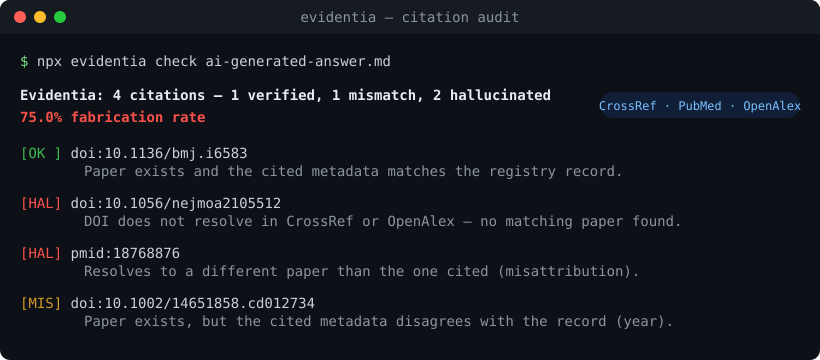

<div align="center">

# Evidentia

### Catch AI-fabricated medical citations before you publish.

The `evidentia` command verifies every citation in a piece of medical writing against **CrossRef, PubMed, OpenAlex, and ClinicalTrials.gov** and grades each one in a 4-tier classification. The companion **Claude Code skill** adds a full 15-criteria evidence appraisal on top. Built by a board-certified pediatrician.



[](https://www.npmjs.com/package/evidentia)
[](https://github.com/kgraph57/evidentia/actions/workflows/ci.yml)
[](LICENSE)
[](https://code.claude.com/docs/en/skills)
[](https://code.claude.com/docs/en/skills)

</div>

---

> **Why now:** A *Lancet* audit of 2.5 million biomedical papers (Topaz et al., May 2026; [doi:10.1016/S0140-6736(26)00603-3](https://www.thelancet.com/journals/lancet/article/PIIS0140-6736(26)00603-3/fulltext)) found that **1 in 277 papers published in early 2026 contained a fabricated reference** — up from 1 in 2,828 in 2023, a **12-fold rise** that tracks the spread of AI writing tools. (The audit screened the PubMed Central open-access subset.) Coverage: [STAT](https://www.statnews.com/2026/05/07/lancet-study-finds-steep-rise-fraudulent-citations-academic-papers/) · [Nature](https://www.nature.com/articles/d41586-026-00748-w) · [Columbia Nursing](https://www.nursing.columbia.edu/news/nearly-3-000-peer-reviewed-medical-papers-have-fake-citations-columbia-nursing-ai-assisted-audit-finds) · [Retraction Watch](https://retractionwatch.com/2026/05/07/one-in-277-pubmed-indexed-papers-in-2026-shows-fabricated-references-says-analysis/).
>
> A fabricated DOI looks exactly like a real one. Evidentia is the open-source tool that resolves each one and tells you which is which.

> ⚕️ **Scope:** Evidentia is a pre-publication aid for **writers, editors, and researchers — not clinical decision support.** It does not diagnose, treat, or replace professional medical judgment.

## 30-second start

**As a command-line tool** (no install, no API key):

```bash
npx evidentia check your-article.md
```

**As a Claude Code skill** (full 15-criteria appraisal):

```bash
/plugin marketplace add kgraph57/evidentia
/plugin install evidentia@evidentia
```

Then just say: *"Fact-check this article"* / *「この記事をファクトチェックして」*.

## What it catches

Here is Evidentia run on a real AI-generated answer about vitamin D and childhood infections — four citations, formatted perfectly, all plausible:

```text
$ npx evidentia check examples/inputs/ai-generated-answer.md

Evidentia: 4 citations — 1 verified, 1 mismatch, 2 hallucinated (75.0% fabrication rate)
  [OK ] doi:10.1136/bmj.i6583       — Paper exists and the cited metadata matches the registry record.
  [HAL] doi:10.1056/nejmoa2105512   — DOI does not resolve in CrossRef or OpenAlex, and no matching paper was found.
  [HAL] pmid:18768876               — Identifier resolves to a different paper ("Trafficking of antigen-specific
                                       CD8+ T lymphocytes…") than the one cited.
  [MIS] doi:10.1002/14651858.cd012734 — Paper exists, but cited metadata disagrees with the record (year).
```

One citation was real. One DOI was invented. One PMID pointed to an unrelated paper. One had the wrong year. **A human reviewer would have to check all four by hand.** Evidentia did it in seconds. See the [full report](examples/reports/ai-generated-answer.report.md).

> This is a deliberately tough example. Most carefully written articles score far lower — Evidentia's value is catching the handful that slip through, every time, without fatigue.

## The 4-tier classification

Most "citation checkers" stop at *"could not verify."* Evidentia keeps going — it resolves the identifier and tells you **why** a citation is suspect:

| Tier | Verdict | Meaning |
|:----:|---------|---------|
| ✅ **1** | **Verified** | The paper exists and the cited title/authors/year/journal match the registry record. |
| ⚠️ **3** | **Bibliographic mismatch** | A real paper exists, but the DOI/PMID is wrong, or the metadata disagrees (a real source cited carelessly — or a fabricated identifier bolted onto a real title). |
| ❌ **4** | **Hallucination** | The identifier resolves to nothing, or resolves to a *completely different* paper. This is the signature of AI-generated text. |
| 🔍 **2** | **Content review needed** | The paper is real, but whether it's used *in the right context* needs a human or an LLM. Handled by the Evidentia skill, below. |

## Two layers: deterministic engine + LLM appraisal

Evidentia is deliberately split into a part a computer can do perfectly and a part that needs judgment:

**1. The engine (CLI + MCP server)** — pure, deterministic citation verification. No API key, no LLM, no hallucination of its own. It answers one question with certainty: *does this cited paper actually exist, and does the identifier point to it?* Use it in a terminal, in CI, or as an MCP tool inside any agent.

**2. The skill (Claude Code)** — wraps the engine in a full **15-criteria critical-appraisal rubric**: evidence level, statistical interpretation (relative vs. absolute risk, NNT), causation vs. correlation, conflicts of interest, exaggeration, population fit, ethics, and more — producing an **A–F report** with concrete fixes. This is the Tier-2 "is it used correctly?" layer the engine can't do alone.

You can use either on its own. Together they cover citation *existence* (deterministic) and citation *honesty* (appraisal).

## Use it as an MCP tool

Give any agent the ability to verify citations:

```bash
claude mcp add evidentia -- npx -y evidentia-mcp
```

The server exposes one tool, `verify_citations(text)`, returning the tiered report as Markdown or JSON.

## Use it in CI

Block a pull request that introduces a fabricated citation. Drop [`.github/workflows/evidentia.yml`](examples/ci/evidentia.yml) into any medical-content repo:

```yaml
- run: npx evidentia check content/**/*.md --fail-on-fabrication
```

`--fail-on-fabrication` exits non-zero if any citation is a mismatch or hallucination.

## The 15-criteria skill (Claude Code)

When invoked as a skill, Evidentia evaluates medical content across 15 dimensions and adapts to the media type — research paper, news article, social post, patient leaflet, conference slide, guideline, pharma marketing, or AI-generated text.

<details>
<summary><b>The 15 criteria</b></summary>

1. Evidence level & study design
2. Citation & source accuracy *(powered by the engine above)*
3. Statistical interpretation
4. Causation vs. correlation
5. Bias & conflicts of interest
6. Exaggeration & overclaiming
7. Target population fit
8. Temporal validity
9. Jargon–readability balance
10. Ethical considerations
11. Logical consistency
12. Images & figures
13. Alternative explanations
14. Clinical relevance
15. Information completeness

Each item is rated **Excellent / Good / Fair / Poor**, aggregated into an overall **A–F** score with a **public-health risk level** (LOW / MEDIUM / HIGH). See [`skills/medical-fact-check/SKILL.md`](skills/medical-fact-check/SKILL.md).
</details>

## Works with your agent

The skill follows the open [Agent Skills](https://code.claude.com/docs/en/skills) `SKILL.md` standard, so it loads in Claude Code today and in any agent that adopts the format. The engine is a plain npm package and an MCP server — usable from Claude Code, Codex CLI, Cursor, or your own scripts.

## Install

### CLI

```bash
# one-off, no install
npx evidentia check article.md

# or install globally
npm install -g evidentia
evidentia check article.md --format md --out report.md
```

```text
evidentia check <file|url|->   Verify citations in a file, web page, or stdin
  --format <md|text|json>      Output format (default: text)
  --out <file>                 Write the report to a file
  --mailto <email>             Contact email for the CrossRef/OpenAlex polite pool
  --fail-on-fabrication        Exit 1 if any citation is mismatch/hallucination (CI)
  --offline                    Extraction only, no network
```

### Claude Code skill / plugin

```bash
/plugin marketplace add kgraph57/evidentia
/plugin install evidentia@evidentia
```

Or copy the skill manually:

```bash
git clone https://github.com/kgraph57/evidentia.git
cp -r evidentia/skills/medical-fact-check ~/.claude/skills/
```

## How verification works

For each citation, Evidentia extracts every identifier (DOI, PMID, arXiv, **NCT trial ID, ISBN**) and any nearby title/author/year, then:

1. **Resolves the DOI** against CrossRef, falling back to OpenAlex.
2. **Resolves the PMID** against PubMed E-utilities.
3. **Resolves NCT trial IDs** against ClinicalTrials.gov.
4. If the identifier doesn't resolve, **searches by title** in OpenAlex — this is how it distinguishes *"real paper, wrong DOI"* (Tier 3) from *"this paper does not exist"* (Tier 4).
5. **Compares** the cited title/authors/year against the registry record to catch a DOI that silently points to a different paper.

It is deliberately careful about **what it does *not* flag**: a book (ISBN), a clinical guideline, or any source that isn't indexed in these registries is marked *"verify manually"* (Tier 2), never *"hallucination"* — only a failing DOI/PMID/NCT (which is *supposed* to resolve) earns a fabrication verdict. Identifier-less entries in a reference list are surfaced for review rather than silently skipped.

All registries are free and keyless. Pass `--mailto` to join the faster "polite pool."

## Examples

| Input | Result |
|-------|--------|
| [AI-generated answer](examples/inputs/ai-generated-answer.md) (real + fabricated mix) | [75% fabrication rate](examples/reports/ai-generated-answer.report.md) |
| [Clean reference list](examples/inputs/clean-references.md) (all real) | [0% — all verified](examples/reports/clean-references.report.md) |

## Limitations

- The **engine** verifies citation *existence and bibliographic accuracy* — not whether a real paper is summarized correctly. That semantic check is the skill's job (Tier 2), and even then it relies on what's publicly indexed (abstracts, open-access full text, metadata).
- This is **decision support for writers, editors, and researchers — not clinical decision support.** It does not diagnose, treat, or replace professional medical judgment.
- Very new papers may not yet be indexed, which can surface as a false "unverified." Re-run later, or pass `--mailto` for the freshest index.

## Roadmap

- [x] Batch input — `evidentia check a.md b.md …` with an aggregate report ([benchmark: 17/17](benchmark/))
- [ ] `evidentia-bench` — grow to 100+ cases and publish per-model fabrication rates
- [ ] CrossRef/OpenAlex abstract retrieval to assist Tier-2 context checks
- [ ] More media presets in the skill

Track it on the [pinned roadmap issue](https://github.com/kgraph57/evidentia/issues).

## Contributing

Issues and PRs welcome — see [CONTRIBUTING.md](CONTRIBUTING.md). Security reports: [SECURITY.md](SECURITY.md).

## About the author

Built by **Ken Okamoto, MD** — a board-certified pediatrician and medical-AI entrepreneur. Evidentia comes out of the daily problem of separating real evidence from confident-sounding fabrication in AI-assisted medical writing.

> 日本語の概要は [README.ja.md](README.ja.md) を参照してください。

## License

[MIT](LICENSE)

> *Evidentia* (the citation-verification tool documented here) is unrelated to "Evidentia" genealogy software.
