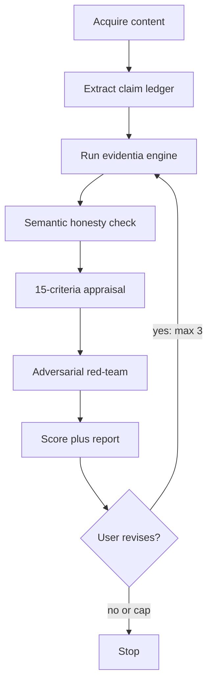

# Medical Fact-Check Skill

Comprehensive critical appraisal and fact-checking for medical information, producing a structured report.

> **Scope.** This is a pre-publication aid for writers, editors, and researchers — **not clinical decision support.** It evaluates how medical *content* is written and sourced; it does not diagnose, treat, or replace professional medical judgment. Do not recommend treatments.

> **Must-read before scoring.** Use the `Read` tool on `references/verification-workflow.md` (operating model, loops, hard rules) and `references/adversarial-review.md` (red-team, KILL/MAJOR/MINOR/PASS) before you emit a letter grade. Also load `references/checklist.md`, `references/evidence-levels.md`, `templates/claim-ledger.md`, and `templates/report-template.md`. Depending on install, the skill directory is `~/.claude/skills/medical-fact-check/` (manual copy) or `${CLAUDE_PLUGIN_ROOT}/skills/medical-fact-check/` (Evidentia plugin).

> **Deterministic citation engine.** When checking citations (Step 4), prefer the local `evidentia` engine over verifying each identifier by hand. Use the `evidentia` binary first; fall back to `npx -y evidentia` only if a local install is unavailable. Evidentia resolves DOI/PMID/arXiv/NCT identifiers against CrossRef, PubMed, OpenAlex, arXiv, and ClinicalTrials.gov, and emits the 4-tier classification plus `lookupVerified` and `resolverOutcomes` lookup traces. Use a cache path when possible so repeat checks are stable and fast. See **Step 4** for how to call it.

## Overview

This skill evaluates medical information across **15 criteria** — evidence quality, citation accuracy, statistical interpretation, ethical considerations, and more — then generates a structured Markdown report with an overall **A–F score** and actionable improvement suggestions.

### Supported Media Types

The skill auto-detects the content type and adjusts its evaluation accordingly:

| Category | Examples | Key Focus |
|----------|----------|-----------|
| **Research papers** | Journal articles, preprints, systematic reviews | Evidence level, methodology, statistical rigor |
| **News & articles** | Health news, medical blogs, magazine articles | Accuracy of claims, source attribution, exaggeration |
| **Social media** | X (Twitter), Instagram, TikTok captions, Reddit, note | Brevity-induced omissions, clickbait, misinformation risk |
| **Newsletters** | Email newsletters, Substack, medical columns | Citation completeness, audience calibration |
| **Patient materials** | Leaflets, brochures, hospital handouts | Readability, completeness, fear-mongering |
| **Video/audio transcripts** | YouTube, podcasts, webinar transcripts | Verbal exaggeration, missing nuance, source attribution |
| **Presentations** | Conference slides, lecture materials, grand rounds | Slide oversimplification, citation on slides |
| **Clinical guidelines** | Practice guidelines, protocols, algorithms | AGREE II compliance, evidence grading, conflicts of interest |
| **Marketing materials** | Pharma ads, medical device brochures, supplement claims | Regulatory compliance, selective data presentation, COI |
| **Health apps & digital** | App descriptions, chatbot outputs, AI-generated content | Hallucination detection, accuracy of automated advice |
| **Textbooks & education** | Textbook chapters, CME/CPD materials, study guides | Currency, completeness, pedagogical accuracy |
| **Infographics** | Visual summaries, data visualizations, social cards | Data integrity, oversimplification, source attribution |

### The 15 Evaluation Criteria

1. Evidence level & study design
2. Citation & source accuracy (incl. AI hallucination detection)
3. Statistical interpretation
4. Causation vs. correlation
5. Bias & conflicts of interest
6. Exaggeration & overclaiming
7. Target population fit
8. Temporal validity
9. Jargon–readability balance
10. Ethical considerations
11. Logical consistency
12. Images & figures
13. Alternative explanations
14. Clinical relevance
15. Information completeness

### Scoring

Each item is rated **Excellent / Good / Fair / Poor**. The overall score:

| Score | Criteria |
|-------|----------|
| **A** | 12+ Excellent, 0 Poor |
| **B** | 12+ Excellent or Good, ≤1 Poor |
| **C** | 12+ Fair or better, ≤2 Poor |
| **D** | 3+ Poor |
| **F** | 5+ Poor, or critical ethical issues |

**Adversarial gates (mandatory).** A **KILL** forces overall score ≤ D (use **F** if ethics, harm, or fabrication). A **MAJOR** cannot be an A. Do not emit a clean A as if the piece is publishable when the verdict is KILL or MAJOR.

## Two layers

- **Engine (deterministic):** DOI/PMID/arXiv/NCT vs CrossRef/PubMed/OpenAlex/arXiv/ClinicalTrials.gov. Tiers 1/3/4 with certainty. ISBN/guideline/title-only → Tier 2 (**Content review needed**), never Hallucination. Never invent a tier if the engine was not run. Never override Tier 4 to "probably real."
- **Skill (judgment):** claim ledger, semantic honesty, 15-criteria appraisal, adversarial red-team. The engine cannot tell you whether a real paper is used honestly.

Named loops (detail in `references/verification-workflow.md`): **engine** (retry once → `unresolved`, not Hallucination), **semantic** (one extra abstract lookup per T1 cite), **adversarial** (max 3; KILL/MAJOR → content must change; re-enter from the engine), **correction** (cap 3; then stop and report remaining issues).

Worked example: `examples/case-studies/vitamin-d-adversarial.md`.

## Workflow

Stage-gated. Do not skip the ledger, the engine, or adversarial review.

### Step 1: Acquire & Analyze

Receive the target medical content from the user. Depending on the input format:

- **URL** — use `WebFetch` to retrieve the content
- **File path** — use `Read` to load the file
- **Pasted text** — analyze directly
- **Video/audio** — if a transcript is provided, analyze it; if a URL is given, attempt to retrieve transcript via WebFetch

Identify the following:

- **Content type**: research paper, blog post, social media, patient leaflet, video transcript, etc.
- **Target audience**: general public, healthcare professionals, patients, researchers, etc.
- **Main claims**: what the content is asserting
- **Citations present**: whether evidence is referenced
- **Language**: the language of the content (evaluate in the original language)
- **Public health risk level**: LOW (educational, niche), MEDIUM (widely shared, actionable claims), HIGH (viral content, safety-critical claims, vulnerable populations)

#### Media-Specific Pre-Analysis

Adjust the evaluation lens based on detected media type:

**Social media posts:**
- Character/space constraints may justify brevity, but core accuracy must be maintained
- Check for misleading compression of complex findings
- Evaluate whether the post drives readers to reliable sources

**Video/podcast transcripts:**
- Verbal hedging may be lost in transcription — look for spoken qualifiers
- Hosts may editorialize beyond guest experts' actual statements
- Check if timestamps or show notes reference sources

**Marketing materials:**
- Apply heightened scrutiny for selective data presentation
- Check regulatory compliance (FDA, PMDA, EMA guidelines for claims)
- Identify undisclosed conflicts of interest

**Clinical guidelines:**
- Apply AGREE II framework for guideline quality assessment
- Check for systematic evidence review methodology
- Verify COI disclosures of guideline panel members

**AI-generated content:**
- Apply maximum citation verification rigor (hallucination detection)
- Check for "confident but wrong" patterns typical of LLM output
- Verify all specific numbers, dates, and named entities

### Step 1.5: Claim ledger (mandatory)

Read `templates/claim-ledger.md` and extract **every testable claim** plus its attached citation (or `none`) into the table: `#`, claim (verbatim), citation/id, engine tier, semantic (`supports` / `cherry-pick` / `mismatch` / `n/a`), adversarial note.

Do **not** skip this even for short social posts (1–3 claims). Headlines count. Leave engine tier / semantic blank until Steps 4 and 4b fill them. Do not score from vibes.

### Step 2: Load Evaluation Checklist

Read `references/checklist.md` (in this skill's directory — see the note at the top) with the `Read` tool to load the detailed 15-item evaluation checklist.

### Step 3: Assess Evidence Levels

If the content references research studies, read `references/evidence-levels.md` with the `Read` tool and evaluate:

- Study design type (RCT, cohort, case report, etc.)
- Study quality (bias risk, sample size, etc.)
- GRADE assessment for overall quality
- Domain-specific considerations (pediatrics, oncology, etc.)

### Step 4: Verify Citations (engine loop)

If the content cites papers or sources, verify them. **Prefer the deterministic engine** for existence and bibliographic checks, then use `WebSearch` for the semantic context check that the engine cannot do.

Engine output is **ground truth for existence**. The LLM must not override Tier 4 to "probably real." Never invent a tier if the engine was not run.

#### 4a. Run the deterministic engine (existence + bibliographic accuracy)

If `evidentia` (or the `verify_citations` MCP tool) is available, run it on the content first. It resolves DOI/PMID/arXiv/NCT identifiers against CrossRef, PubMed, OpenAlex, arXiv, and ClinicalTrials.gov and returns Tiers 1, 3, and 4 with certainty — no model guesswork. Books (ISBN), guidelines, title-only citations, and other non-indexed sources are returned as Tier 2 (**Content review needed**), never as fabrications.

Preferred command (local binary):

    evidentia check <file-or-url> --format json --cache "$HOME/.cache/evidentia/verification-cache.json" --mailto <your-email>

Fallback if the local binary is unavailable:

    npx -y evidentia check <file-or-url> --format json --cache "$HOME/.cache/evidentia/verification-cache.json" --mailto <your-email>

**Engine loop:** if unreachable, retry **once**. If still down, mark those citations `unresolved` (not Hallucination) and continue. Never guess a Hallucination without a failed identifier lookup.

Use its output as the ground truth for citation *existence*. Inspect `lookupVerified` and `resolverOutcomes` when explaining why a citation was classified. Write the engine tier into the claim ledger.

- **Tier 1 (Verified)** — the paper, preprint, or trial exists and metadata matches. Proceed to the context check in 4b.
- **Tier 2 (Content review needed)** — the source may be real, but the engine cannot deterministically verify it in registries, or semantic use still needs review.
- **Tier 3 (Bibliographic mismatch)** — a real record exists, but the DOI/PMID/arXiv/NCT identifier or metadata is wrong. Record the discrepancy.
- **Tier 4 (Hallucination)** — the identifier resolves to nothing or to a different paper. Flag as a fabricated citation immediately; this is the highest-severity finding.

If the engine is not available, fall back to verifying each identifier manually with `WebSearch` (steps below). Still do not invent a Hallucination for ISBN/guideline/title-only sources.

#### 4b. Semantic loop (honesty — the engine cannot do this)

For every citation the engine marked **Verified** (Tier 1), still confirm it is used honestly:

1. Fetch the abstract (WebSearch / WebFetch) and cross-check it against the cited claim — primary outcome, population, direction of effect.
2. Evaluate context — is the citation cherry-picked or accurately represented?
3. Downgrade to **Tier 2 (Content review needed)** if a real paper is being misrepresented or cited out of context. Set semantic to `mismatch` or `cherry-pick`.

**Semantic loop cap:** one extra lookup per citation, then stop. Paywalled with no abstract → semantic `n/a`, note "abstract unavailable," leave the engine tier in place. Do not use this loop to upgrade a Tier 3 or 4.

#### Manual fallback (if the engine is unavailable)

1. **Search** by DOI, PMID, or title to locate the original paper
2. **DOI cross-verification** — confirm the DOI resolves to the claimed paper (matching title, authors, journal)
3. **Cross-check** the abstract against the cited claims and evaluate context

#### AI Hallucination Detection (Critical)

AI-generated text (ChatGPT, Claude, Gemini, etc.) frequently contains plausible but fabricated citations. When a citation cannot be confirmed, perform these additional checks:

- Does the DOI point to a completely different paper? (Search the DOI directly and compare title/authors)
- Does the author actually exist and publish in this field?
- Do the journal name, volume, and page numbers match a real publication?

**Do NOT stop at "could not verify."** Actively determine whether the citation is unverifiable or provably fabricated. Engine-down is `unresolved`, not Hallucination.

Classify each citation into one of 4 tiers:

| Tier | Classification | Description |
|------|---------------|-------------|
| 1 | **Verified** | Paper exists and content matches the citation |
| 2 | **Content review needed** | The paper is real, but whether it is used in the right context needs a human or an LLM. Also used when the engine cannot verify the source in registries (books, guidelines, title-only). |
| 3 | **Bibliographic mismatch** | Paper exists but DOI, author, or journal info is wrong |
| 4 | **Hallucination** | DOI points to an unrelated paper, or the paper does not exist |

### Step 5: Detailed Evaluation

Rate each of the 15 items using these dimensions:

- **Current state**: objective description of how the content handles this criterion
- **Issues**: specific problems identified (or "None")
- **Suggestions**: concrete, actionable improvements (if issues exist)
- **Rating**: Excellent / Good / Fair / Poor

Do not recommend treatments. Suggestions are about how the *content* should be rewritten (cite the primary paper, add ARR, hedge the causal verb) — not about what a patient or clinician should take.

#### Media-Specific Evaluation Adjustments

| Criterion | Social Media | Marketing | Guidelines | Patient Materials |
|-----------|-------------|-----------|------------|-------------------|
| #1 Evidence level | Expect source links | Heightened scrutiny | GRADE required | Simplified OK |
| #2 Citations | At minimum, name sources | Full disclosure required | Systematic search required | Source available on request |
| #6 Exaggeration | Very common — flag aggressively | Primary concern | Should be absent | Watch for false reassurance |
| #7 Population fit | Often ignored — flag | Check indication scope | Must be explicit | Must match audience |
| #9 Readability | Platform-appropriate | Accessible to HCPs + public | HCP-level acceptable | 6th-grade reading level |
| #10 Ethics | Check stigma/fear | Check manipulation | Check COI panel | Check dignity/autonomy |
| #12 Images | Memes, infographics | Selective visuals | Evidence figures | Clear illustrations |

### Step 5.5: Adversarial review (mandatory)

Read `references/adversarial-review.md` with the `Read` tool. Run the five lenses (citation integrity, claim support, statistics and language, harm, steelman-then-attack). Answer the 10-line attack checklist (yes/no + evidence). Emit **KILL / MAJOR / MINOR / PASS**.

- **KILL** — any Tier 4 presented as real, or advice that could cause harm if followed. Content must not be published as-is. Overall score ≤ D (F if ethics/harm/fabrication). This is the system working.
- **MAJOR** — real sources, dishonest use, causal overclaim, missing fair balance. Must fix before publish. Cannot be an A.
- **MINOR** — hedging, currency, readability. Should fix.
- **PASS** — ship with stated caveats. Human still owns publish.

KILL or MAJOR: do **not** emit a clean A-score as if publishable; tell the user the content must change. If they revise, re-enter from the **engine** (Step 4), not from scoring. Max **3** adversarial passes per document.

### Step 6: Determine Overall Score

Aggregate the 15 item ratings into an A–F score using the criteria table in the Overview section, then apply the adversarial gates above.

Additionally, flag a **Public Health Risk Assessment**:

- **LOW RISK**: Content is broadly accurate; issues are minor or stylistic
- **MEDIUM RISK**: Content has meaningful inaccuracies that could mislead readers
- **HIGH RISK**: Content promotes harmful actions, contains fabricated evidence, or targets vulnerable populations with dangerous misinformation

### Step 7: Generate Report

Read the report template from `templates/report-template.md` (in this skill's directory) with the `Read` tool and produce the structured report.

**Required sections:**
1. Content Overview — title, source, audience, date, media type
2. Overall Assessment — score, **adversarial verdict**, key issues summary, risk level, recommended actions
3. Detailed Evaluation — all 15 items with ratings, issues, and suggestions
4. Citation Verification Results — engine vs semantic columns; paste or summarize engine JSON; use **Content review needed** (the previous mismatch wording is retired)
5. Adversarial review — lenses, steelman, attack, checklist, verdict
6. Loop log — engine runs, semantic lookups, adversarial pass #, remaining issues
7. Critical Concerns — flagged high-severity issues
8. Strengths — positive aspects worth noting
9. Suggested Corrections — before/after comparison text (if issues found)
10. References — sources used during evaluation
11. Evaluator Notes — overall commentary and caveats

### Step 8: Deliver Report

Save the completed report as a Markdown file using `Write`:

- **File name**: `medical-fact-check-report-YYYY-MM-DD.md` in the current directory
- If a report with that name already exists, append a suffix: `-2`, `-3`, etc.
- Provide the user with:
  - The file path
  - A concise summary of findings (3–5 sentences)
  - The overall score, adversarial verdict, and risk level
  - Top 3 most important issues to address

### Step 9: Correction loop (up to 3)

Not optional. If the user revises the content based on the report:

1. Re-read the revised content.
2. Re-run the **engine** on the document (at least every changed or new citation).
3. Re-run the **semantic** loop on changed Tier 1 citations.
4. Re-run **adversarial** review (counts toward the 3-pass cap). Re-enter from the engine, not from scoring.
5. Update the claim ledger, loop log, and recommended-actions checklist.
6. Check that corrections have not introduced new problems (shifted reference numbers, new causal verbs).
7. List remaining unresolved issues.
8. Save the updated report with a `-rev2` (or `-rev3`) suffix.

**Cap: 3.** Then stop and report what is still open. Do not raise the letter grade while a KILL/MAJOR or a new Tier 4 remains.

## Media-Specific Handling

### Social Media Posts

Short-form content requires particular attention to:
- Accuracy maintained despite brevity constraints
- Absence of critical caveats or disclaimers
- Clickbait titles or misleading framing
- Whether sources are linked or accessible
- Potential for viral spread of misinformation (amplification risk)

### Video & Podcast Transcripts

Audio/video content often has unique issues:
- Host editorialization beyond guest expert statements
- Verbal hedging that doesn't survive transcription
- Unsubstantiated anecdotes presented as evidence
- Missing visual context in audio-only formats
- Show notes or descriptions that may overstate content

### Conference Presentations & Slides

Slide decks present compressed information:
- Oversimplification of complex findings to fit slides
- Missing citations on individual slides
- Unpublished data presented without caveats
- Potential COI with industry-sponsored presentations
- Conclusions drawn from preliminary/incomplete data

### Clinical Guidelines

Guidelines demand the highest methodological standards:
- AGREE II framework compliance
- Systematic literature review methodology
- GRADE evidence assessment
- Panel member COI disclosures
- Update currency and version control
- Patient/public involvement in development

### Pharmaceutical & Device Marketing

Marketing materials require heightened skepticism:
- Selective presentation of favorable trial results
- Relative risk reduction without absolute figures
- Off-label use implications
- Regulatory compliance of claims
- Fair balance between efficacy and safety data
- Comparator selection bias

### AI-Generated Medical Content

LLM-generated content requires the most rigorous citation checking:
- Apply hallucination detection to ALL citations
- Verify specific statistics, percentages, and dates
- Check for "confident confabulation" — authoritative tone on incorrect facts
- Flag instances where the AI fills knowledge gaps with plausible fiction
- Verify named entities (researchers, institutions, journals)

### Patient-Facing Materials

Patient materials prioritize accessibility and safety:
- Reading level appropriate for target audience (aim for 6th-grade level for general public)
- No unnecessary fear-mongering or false reassurance
- Clear action items and when to seek professional help
- Respect for patient autonomy and informed decision-making
- Cultural sensitivity and inclusivity

## Best Practices for Report Writing

1. **Be specific** — not "there is a problem" but "Section 3, paragraph 2 claims X, but the cited study actually found Y"
2. **Be constructive** — always pair criticism with a concrete suggestion
3. **Be balanced** — acknowledge strengths alongside weaknesses
4. **Cite your sources** — reference the guidelines or papers that inform your evaluation
5. **Consider the audience** — evaluation standards differ for professional vs. public content
6. **Stay practical** — improvement suggestions should be realistic and actionable
7. **Disclose limitations** — acknowledge what this AI-based review can and cannot verify
8. **Record the loops** — engine JSON, semantic lookups, adversarial pass number, remaining issues belong in the report, not only in your head

## Caveats

1. **Not a substitute for expert judgment** — this is an AI-based evaluation tool
2. **Full-text access is limited** — verification relies on abstracts, open-access articles, and bibliographic metadata
3. **Image evaluation is limited** — cannot deeply analyze embedded figures or video content
4. **Rapidly evolving fields** — the most current evidence may not yet be indexed
5. **Final medical decisions** should always be made by qualified healthcare professionals
6. **Not CDS** — do not recommend treatments; the human publishes

## Reference Files

- `references/verification-workflow.md` — operating model, two layers, named loops, hard rules (must-read before scoring)
- `references/adversarial-review.md` — five lenses, attack checklist, KILL/MAJOR/MINOR/PASS (must-read before scoring)
- `references/checklist.md` — detailed 15-item evaluation checklist
- `references/evidence-levels.md` — evidence hierarchy & quality assessment tools
- `templates/claim-ledger.md` — claim table filled before the engine call
- `templates/report-template.md` — structured report template (verdict, engine JSON, loop log)

## External References

- Cochrane Handbook for Systematic Reviews of Interventions
- GRADE Working Group
- AGREE II (Appraisal of Guidelines for Research & Evaluation)
- AMSTAR 2 (A MeAsurement Tool to Assess systematic Reviews)
- CONSORT, STROBE, PRISMA reporting guidelines
- FDA / PMDA / EMA advertising and promotion regulations
- DISCERN (quality of health information for patients)
- HONcode (Health On the Net Foundation)
