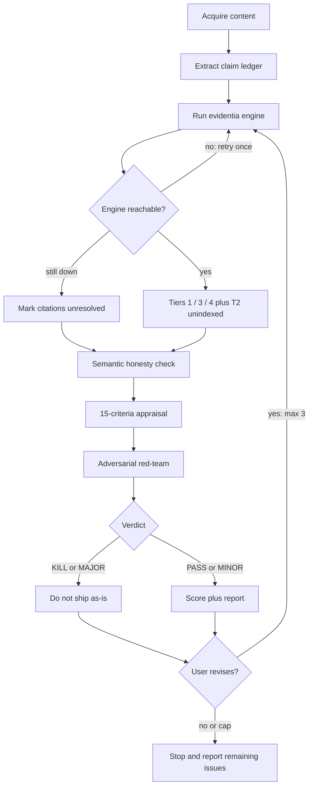

# Verification workflow

Operating model for the medical-fact-check skill. Read this before scoring. This is a **content** fact-check before publish — not clinical decision support, and not a manuscript pipeline. Do not recommend treatments.

## Pipeline

Acquire content → Extract claim ledger → Run evidentia engine (existence) → Semantic honesty check (abstract vs claim) → 15-criteria appraisal → Adversarial red-team → Score + report → Correction loop (if the user revises).

## Two layers

### Engine (deterministic)

The `evidentia` CLI or MCP `verify_citations` resolves DOI / PMID / arXiv / NCT against CrossRef, PubMed, OpenAlex, arXiv, and ClinicalTrials.gov. It emits Tiers **1 / 3 / 4** with certainty, plus Tier **2** for sources it cannot index.

- Engine output is **ground truth for existence**.
- Never invent a tier if the engine was not run.
- Never override Tier 4 to "probably real."
- ISBN, guidelines, title-only, and other unindexed sources are **Tier 2 (Content review needed)**, never Hallucination.
- If the engine is down after one retry, mark those citations `unresolved` — not Hallucination. A Hallucination label requires a failed identifier lookup, not a missing tool.

### Skill (judgment)

Context, cherry-picking, statistics, ethics, language, and adversarial review. The engine cannot tell you whether a real paper is being used honestly. That is the skill's job.

This skill evaluates how medical *content* is written and sourced. It does not diagnose, treat, or replace professional medical judgment.

## Claim ledger

Fill `templates/claim-ledger.md` **before** the engine call, even for a 1–3 claim social post. Do not score from vibes.

| Column | What goes in it |
|--------|-----------------|
| # | Sequential claim number |
| claim | Verbatim sentence or tight paraphrase of the testable assertion |
| citation / id | DOI, PMID, arXiv, NCT, or "none" |
| engine tier | 1 / 2 / 3 / 4 / unresolved / n/a (no identifier) |
| semantic | supports / cherry-pick / mismatch / n/a |
| adversarial note | Short flag from red-team, or blank |

Every numeric, causal, or safety-relevant sentence is a claim. Headlines count.

## Loops

Four named loops. Each has a stop condition. "FAIL" means the gate did not clear — not that you invent a worse tier.

### 1. Engine loop

**Do:** run `evidentia check <file-or-url> --format json` (or MCP `verify_citations`) with a cache path and `--mailto` when using the CLI.

**FAIL:** engine unreachable or non-zero with no JSON.

**Retry:** once.

**Then:** if still down, mark affected citations `unresolved`. Continue the rest of the appraisal. Do **not** guess Hallucination without a failed identifier lookup.

**Do not:** override a returned Tier 4 because the title "sounds real." Do not invent Tier 1 from WebSearch when the engine already said 3 or 4. Manual WebSearch is the fallback only when the engine is unavailable, and even then a 404/empty registry hit is Hallucination — a book, guideline, or title-only cite is still Tier 2.

### 2. Semantic loop

**Scope:** every Tier 1 citation that supports a claim in the ledger (especially numeric or causal claims).

**Do:** fetch the abstract (WebSearch / WebFetch). Test: does the cited claim match the paper's actual finding — primary outcome, population, direction of effect?

**FAIL:** abstract contradicts the claim, or the claim uses a secondary/subgroup finding as if it were the main result → downgrade that citation to **Tier 2 (Content review needed)** and set semantic to `mismatch` or `cherry-pick`.

**Retry:** one extra lookup per citation, then stop. Paywalled with no abstract → semantic `n/a`, note "abstract unavailable," leave the engine tier in place.

**Do not:** use the semantic loop to "upgrade" a Tier 3 or 4. Existence is the engine's job.

### 3. Adversarial loop

**When:** after the 15-criteria pass, before emitting a clean score.

**Do:** Read `references/adversarial-review.md`. Run the five lenses and the attack checklist. Verdict: **KILL / MAJOR / MINOR / PASS**.

**FAIL:**
- **KILL** or **MAJOR** — do not emit a clean A as if the piece is publishable. Tell the user the content must change. A KILL forces overall score ≤ D (F if ethics, harm, or fabrication). A MAJOR cannot be an A.
- **MINOR** — ship only with stated caveats; still list the fixes.
- **PASS** — score as earned; human still owns publish.

**Retry:** if the user revises, re-enter from the **engine** (not from scoring). Max **3** adversarial passes per document. After 3, stop and report remaining issues.

### 4. Correction loop

Step 9 is a protocol, not an optional courtesy.

**When:** the user revises the content after a report.

**Do:**
1. Re-read the revised text.
2. Re-run the engine on the document (or at least on every changed / new citation).
3. Re-run the semantic loop on changed Tier 1 citations.
4. Re-run adversarial review (counts toward the 3-pass cap).
5. Update the ledger, loop log, and recommended-actions checklist.
6. Check that fixes did not introduce new problems (shifted reference numbers, new causal verbs).

**Cap:** 3. Then stop and report what is still open.

**FAIL:** a new Tier 4, a new KILL/MAJOR, or an unfixed previous KILL/MAJOR. Do not raise the letter grade while those remain.

## Hard rules

1. Engine output is ground truth for existence. The LLM must not override Tier 4 to "probably real."
2. Never invent a tier if the engine was not run. If it was not run, say so and use `unresolved`.
3. ISBN / guideline / title-only → Tier 2 (Content review needed), never Hallucination.
4. Semantic mismatch of a real paper is Tier 2, not Tier 4.
5. Not CDS. Do not recommend treatments, doses, or "what the patient should do."
6. The AI recommends; the human publishes.

## What FAIL does *not* mean

- Engine down ≠ Hallucination.
- Unindexed book ≠ Hallucination.
- Abstract unavailable ≠ mismatch.
- MINOR ≠ a hidden KILL. Record the actual verdict.
